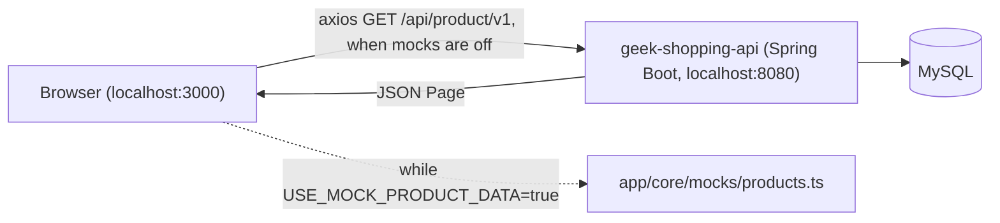
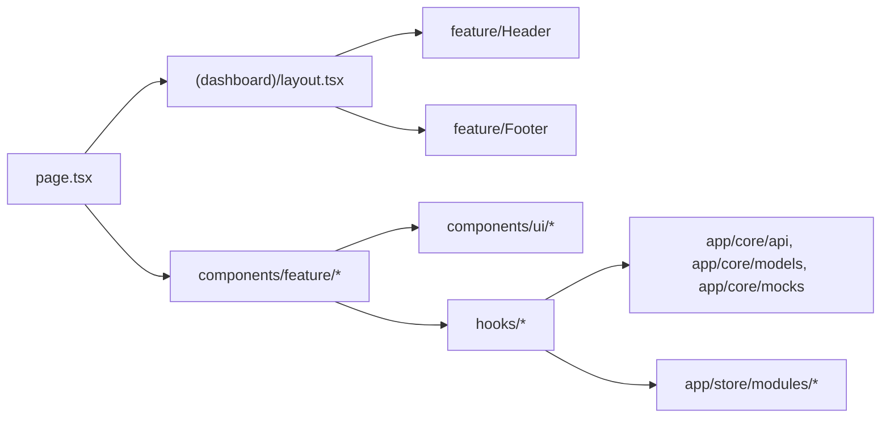
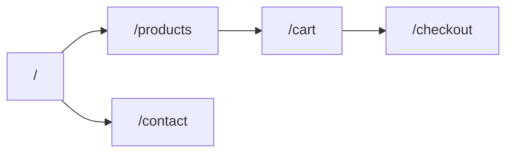
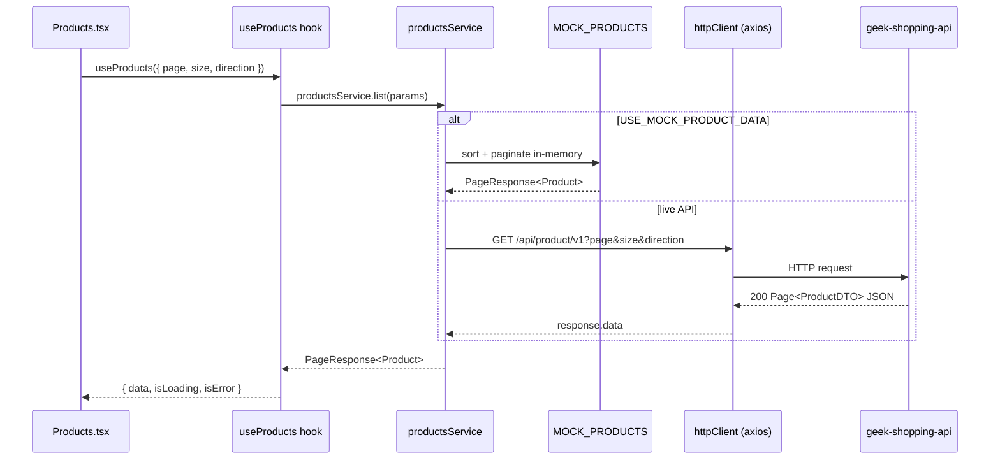
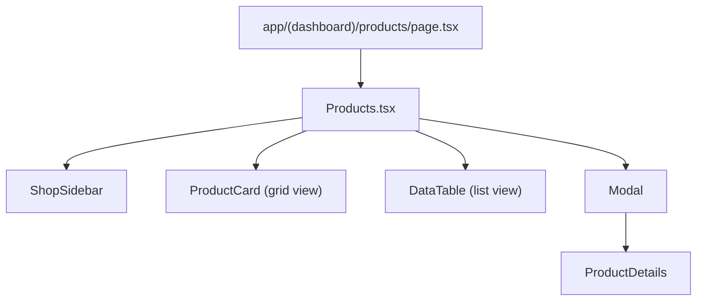

# Architecture

## 1. Overview

`geek-shopping-app` is the storefront frontend for Geek Shopping. It ships all 5 pages of its reference storefront design — Home, Shop, Shopping Cart, Checkout, and Contact — as a literal, page-by-page port: same sections, same layout density, same images, in the same order. The catalog is currently served from a local mock dataset (see section 2) because the live `geek-shopping-api`'s product images are broken; everything else (cart, wishlist, search, filters) runs on real client state.

## 2. Tech stack

| Technology | Why |
| --- | --- |
| Next.js (App Router) | File-based routing, server/client component split, zero-config build pipeline. |
| TypeScript (strict) | Type safety across API contracts, props, and state. |
| Tailwind CSS v4 + CSS Modules | Utility classes for layout speed, CSS Modules for component-scoped, non-leaking styles. |
| TanStack Query | Caching, retries and loading/error state for server/mock data (products). |
| Zustand | Client/UI state shared across components: wishlist, cart, header search term. |
| Axios | Central HTTP client with interceptors for consistent error handling (used once mocks are turned off). |
| `react-icons/fa` | Icon set matching the reference design's Font Awesome 5 visual language. |
| Vitest + Testing Library | Fast, Vite-native unit/component testing. |

### Mock data mode

```ts
// app/core/api/products.ts
export const USE_MOCK_PRODUCT_DATA = true;
```

While `true`, `productsService.list()` serves `app/core/mocks/products.ts` (9 items, paginated/sorted in-memory) instead of calling the live API. `app/core/mocks/categories.ts` derives the Home page's category grid from that same mock catalog (real counts, not fabricated ones). The cart (`app/store/modules/cart/useCartStore.ts`) also starts pre-seeded with a few mock items so `/cart` and `/checkout` aren't empty on first load. Flip `USE_MOCK_PRODUCT_DATA` to `false` and remove the mock branch to go back to live data once the backend's images are fixed.

Prices are formatted as Brazilian Real (`app/core/utils/currency.ts`, `pt-BR`/`BRL`); addresses, phone numbers, and postal codes throughout the app (footer, contact page, checkout form) follow Brazilian conventions, using Av. Brasil, 123 - Centro, Uberlândia - MG as the example address.

## 3. High-level diagram



## 4. Folder structure

```
app/
  (dashboard)/layout.tsx         — Header + Footer shell, wraps every route below
  (dashboard)/page.tsx           — Home
  (dashboard)/products/page.tsx  — Shop
  (dashboard)/cart/page.tsx      — Shopping Cart
  (dashboard)/checkout/page.tsx  — Checkout
  (dashboard)/contact/page.tsx   — Contact
  core/
    api/                         — httpClient.ts + one file per REST resource
    models/                      — shared TS types (Product, PageResponse)
    mocks/                       — temporary mock catalog + categories
    utils/                       — small shared helpers (currency formatting, BRL)
  store/
    modules/global/              — useWishlistStore
    modules/cart/                — useCartStore
    modules/products/            — useProductFiltersStore (header search term)
components/
  ui/atoms/                      — Button, Input, Select
  ui/molecules/                  — Modal, DataTable, Carousel
  feature/Header/, feature/Footer/ — global shell
  feature/Home/                  — Home page
  feature/Products/              — Shop page: ShopSidebar, ProductCard, ProductDetails
  feature/Cart/, feature/Checkout/, feature/Contact/ — the other 3 pages
hooks/
  useProducts/, useCart/, useWishlist/, useProductFilters/
styles/
  _reset.css, tokens/*.css       — brand tokens (see section 9)
```

Dependency direction (always one way):



## 5. Real file tree — Products (Shop) feature

```
components/feature/Products/
  Products.tsx           — screen root: sidebar filters, toolbar, grid/list switch, pagination, modal wiring
  Products.module.css
  index.ts
  ShopSidebar/            — price/color/size filters, counts computed from the real (mock) catalog
  ProductCard/            — grid-view card: image, hover action overlay, rating, price
  ProductDetails/         — content rendered inside the quick-view Modal, with Add to Cart
```

`Home`, `Cart`, `Checkout`, and `Contact` follow the same `<Name>.tsx` + `.module.css` + `index.ts` shape; see section 4 for what each contains.

## 6. Routing



All 5 routes live under the `(dashboard)` group and share the `Header`/`Footer` shell.

## 7. State management

| Concern | Tool | Example |
| --- | --- | --- |
| Server/mock data (product list, pagination) | TanStack Query | `hooks/useProducts/useProducts.ts` |
| Local UI state scoped to one screen (sort, page size, view mode, selected product, checkout form fields) | React `useState` | `Products.tsx`, `Checkout.tsx` |
| Cross-component client state | Zustand | `useWishlistStore` (favorited ids), `useCartStore` (quantities per product id), `useProductFiltersStore` (header search term, read by `Products.tsx`) |

Stores are read through selector-based facade hooks (`hooks/useWishlist`, `hooks/useCart`, `hooks/useProductFilters`), not the raw store, so a component only re-renders on the slice it reads.

## 8. Data/API layer



`httpClient.ts` centralizes the axios instance and normalizes every failure into an `ApiError(message, status)`.

## 9. Design system

See `.claude/skills/geek-shopping-app-visual-identity/SKILL.md` for the full brand token table. Summary of components:

| Component | Layer | Notes |
| --- | --- | --- |
| `Button` | atom | `variant` (`primary`/`dark`/`secondary`/`ghost`) + `square` prop. |
| `Input`, `Select` | atoms | Standard HTML props passthrough + optional `label`. |
| `Modal` | molecule | `maxWidth` prop — used for the Products quick-view. |
| `DataTable` | molecule | Generic `columns` prop — the Shop page's **list view**. |
| `Carousel` | molecule | New: generic slide carousel (autoplay, dots, arrows) — used for the Home hero and reusable for any future slideshow. |
| `ProductCard` | feature component | The Shop/Home grid-view card: image zoom, staggered hover actions, rating stars, original-price strikethrough (all from mock data). |
| `ShopSidebar` | feature component | Price/color/size filters — real, computed from the mock catalog. |

## 10. Feature folder pattern



## 11. Naming convention

Not applicable — content language is English (route/component names match); the example address/phone/postal-code values follow Brazilian formatting conventions as data, not as a code-identifier language.

## 12. Testing

- `npm test` — runs Vitest once.
- `npm run test:coverage` — Vitest with v8 coverage; `app/core/api`, `app/core/mocks`, `app/store`, and barrel `index.ts` files are excluded (thin wiring/fixtures, not logic).
- `components/ui/atoms/Button/__test__/Button.test.tsx` is the only test so far.

## 13. How to add a new feature

1. Add the route folder under `app/(dashboard)/<route>/page.tsx` — it automatically gets the `Header`/`Footer` shell.
2. Add `app/core/models/<domain>.ts` and `app/core/api/<domain>.ts` for the new resource.
3. Add `hooks/use<Domain>/use<Domain>.ts` wrapping the TanStack Query call.
4. Add `components/feature/<Name>/`; reuse `ui/atoms` and `ui/molecules` before creating new ones.
5. If the feature needs state shared outside its own tree, add `app/store/modules/<scope>/use<Scope>Store.ts` + a facade hook.
6. Update this file's sections 4–10 with the new feature's real names.

## 14. References

- [`README.md`](./README.md) — quickstart, mock-data notice, page list.
- `.claude/skills/geek-shopping-app-visual-identity/SKILL.md` — brand tokens, component inventory, fidelity/omission checklist.
